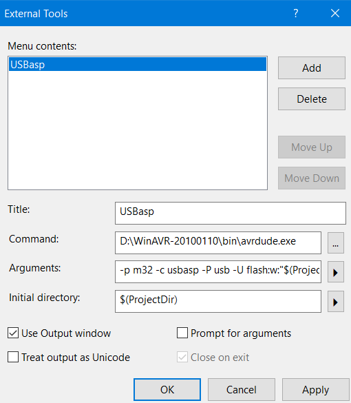

# Installing AVRDUDE for Atmel Studio(latest version known as Microchip Studio)

## Install drivers for USBasp cable

1. Go to https://zadig.akeo.ie/ and download Zadig
2. Plug the USBasp cable into one of the USB ports.
3. Open zadig executable file.
4. Click Options -> List All Devices -> Select USBasp from the Drop down menu.
5. Select `libusb-win32 (v1.2.6.0)` and click install driver.

## Install WinAVR using the link https://sourceforge.net/projects/winavr/

WinAVR (tm) is a suite of executable, open source software development tools for the Atmel AVR series of RISC microprocessors hosted on the Windows platform. Includes the GNU GCC compiler for C and C++.

## Go to `External Tools` of the `Tools` in the menu bar of the Atmel studio

```
Title: USBasp // give a suitable name
Command: D:\WinAVR-20100110\bin\avrdude.exe // directory where WinAVR is installed.
Arguments: -p m32 -c usbasp -P usb -U flash:w:"$(ProjectDir)Debug\$(TargetName).hex":i // arguments are for ATMEGA32
Initial Directory: $(ProjectDir)
```
Dont forget to check Use output window and Prompt for arguments (optional). After adding these entries your external tools window will look like this. Then press Apply and OK.



## Before use avrdude Solution must be built. Then it can be uploaded to the MCU (Microcontroller Unit)
1. Menu bar -> Build -> Build Solution
2. Tools -> USBasp
